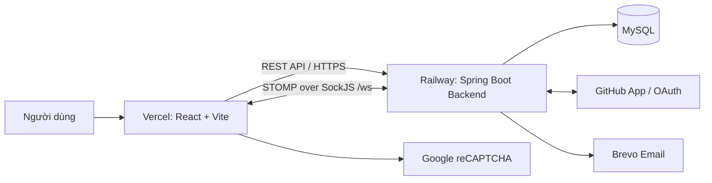
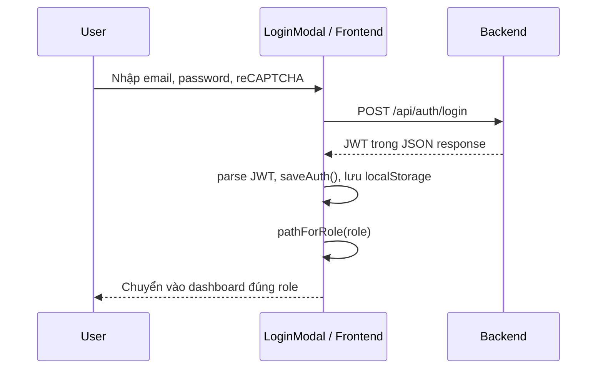
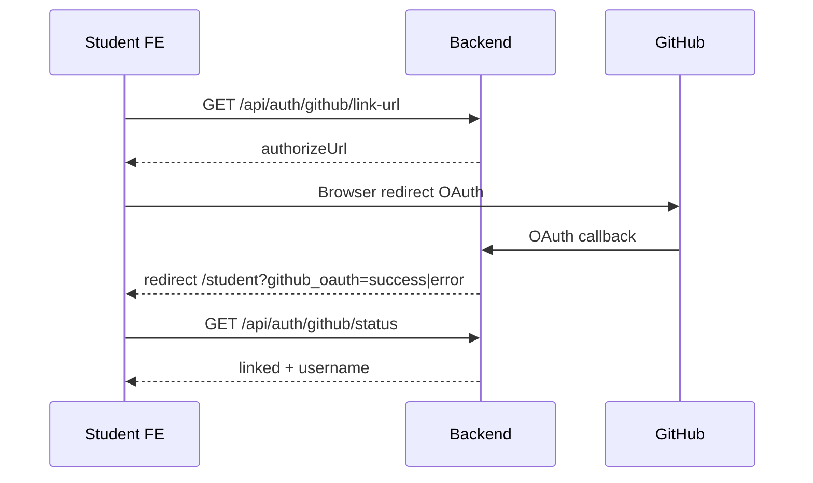

# Tổng hợp kiến thức và cấu trúc Frontend — SEAL Hackathon

> Phạm vi: tài liệu này mô tả Frontend đang có trong thư mục `frontend/`, đối chiếu trực tiếp với source code vào ngày 31/07/2026. Mục tiêu là giúp thành viên mới biết ứng dụng được tổ chức thế nào, dữ liệu đi qua đâu và nên sửa phần nào khi thêm chức năng.

---

## 1. Tổng quan kiến trúc

Frontend là một Single Page Application (SPA): trình duyệt chỉ tải một ứng dụng React; khi người dùng chuyển trang, React Router thay nội dung giao diện mà không tải lại toàn bộ website.



**Nguyên tắc quan trọng:**

- Frontend chịu trách nhiệm hiển thị UI, nhận thao tác, validate cơ bản và gọi API.
- Backend là nguồn xác thực cuối cùng cho quyền hạn, trạng thái event, GitHub repository, dữ liệu điểm và database.
- Frontend không được chứa secret như GitHub private key, GitHub client secret, JWT secret, Brevo API key hoặc reCAPTCHA secret. Các secret này chỉ nằm ở Backend/Railway.

## 2. Công nghệ đang dùng

| Nhóm | Công nghệ | Vai trò |
|---|---|---|
| Framework | React 18 | Xây dựng UI theo component |
| Build tool | Vite 5 | Dev server, build production, inject biến `VITE_*` |
| Điều hướng | React Router DOM v6 | Khai báo route, redirect và guard |
| Gọi API | Native `fetch` qua `api/client.js` | Thống nhất base URL, JWT, lỗi và cookie |
| State global | React Context | Quản lý phiên đăng nhập và toast |
| State màn hình | `useState`, `useEffect`, `useMemo`, `useCallback` | State cục bộ trong từng page/component |
| Realtime chat | STOMP + SockJS | Subscribe/publish message qua WebSocket |
| Editor | CKEditor 5 | Nội dung rich text nếu page sử dụng |
| Test FE | Vitest | Unit test cho API client, normalizer, JWT và utility |
| Deploy | Vercel | Host static files của Frontend |

Ứng dụng **không dùng Redux/Zustand**. Với quy mô hiện tại, state global chỉ nên để ở Context khi thật sự dùng xuyên nhiều khu vực; còn state của form/list/modal nên giữ ngay trong page chứa nó.

## 3. Cấu trúc thư mục

```text
frontend/
├── src/
│   ├── main.jsx                    # Điểm khởi động React + BrowserRouter
│   ├── App.jsx                     # Route tree, providers, lazy loading
│   ├── api/                        # Hàm giao tiếp Backend, chia theo domain
│   ├── assets/images/              # Ảnh dùng trong UI
│   ├── components/
│   │   ├── common/                 # Component tái sử dụng: modal, form, loading...
│   │   ├── layout/                 # Navbar, topbar, dashboard layout, footer
│   │   ├── dashboard/              # Header, tab, module container
│   │   ├── chat/                   # Chat popup/panel
│   │   ├── expert/                 # UI chung cho Mentor/Judge
│   │   └── judge/                  # Rubric, score modal, submission links
│   ├── context/                    # AuthContext và ToastContext
│   ├── guards/                     # RequireAuth và RequireRole
│   ├── hooks/                      # useChatStomp, useRecaptcha
│   ├── pages/                      # Màn hình cấp page/dashboard
│   ├── styles/global.css            # CSS global và style dùng toàn hệ thống
│   ├── test/                       # Helper phục vụ Vitest
│   └── utils/                      # JWT, error mapping, labels, reCAPTCHA
├── .env.example                    # Mẫu biến môi trường FE
├── package.json                    # Scripts/dependencies
└── vite.config.js                  # Vite config + proxy local /api và /ws
```

### Quy tắc đặt code

| Nếu cần thêm... | Nên đặt ở đâu? |
|---|---|
| Một API nghiệp vụ mới | `src/api/<domain>.js` |
| Một màn hình/route lớn | `src/pages/...` và khai báo route trong `App.jsx` |
| Một block UI tái sử dụng | `src/components/common/` hoặc thư mục domain phù hợp |
| State dùng nhiều màn hình | cân nhắc `src/context/` |
| Logic UI tái dùng, side effect | `src/hooks/` |
| Chuyển đổi format/trạng thái/lỗi | `src/utils/` hoặc `api/normalizers.js` |

Không nên gọi `fetch` trực tiếp trong page khi đã có `apiFetch`; không nên dồn API, JSX và mapping response vào một file lớn.

## 4. Entry point và vòng đời render

`src/main.jsx` render ứng dụng theo chuỗi:

```text
React.StrictMode
  └─ BrowserRouter
       └─ App
            ├─ AuthProvider
            ├─ ToastProvider
            └─ Routes
```

- `React.StrictMode` giúp phát hiện side-effect chưa an toàn trong môi trường phát triển. Vì vậy `useEffect` phải có cleanup/cancel hợp lý.
- `BrowserRouter` đọc URL hiện tại và quản lý lịch sử Back/Forward.
- `AuthProvider` khôi phục phiên từ `localStorage` và JWT.
- `ToastProvider` cung cấp thông báo thành công/lỗi cho các page.
- `App.jsx` dùng `React.lazy` + `Suspense` cho dashboard để không tải toàn bộ code ngay ở landing page.

## 5. Routing và phân quyền

### 5.1 Routes hiện tại

| URL | Guard | Màn hình |
|---|---|---|
| `/` | Public | `HomePage` landing page |
| `/student` | Student | `StudentDashboard` |
| `/staff` | Staff/Coordinator | `StaffLayout` dạng tab |
| `/staff/events/:eventId` | Staff | `EventDetailsPage` |
| `/staff/events/:eventId/check-in` | Staff | `StaffCheckInPage` |
| `/mentor` | Mentor/Expert | `MentorDashboard` |
| `/judge` | Judge/Expert | `JudgeDashboard` |
| `/profile` | Đã đăng nhập | `StaffProfilePage` |
| URL khác | — | redirect về `/` |

### 5.2 Route guard hoạt động thế nào?

`RequireAuth` kiểm tra người dùng đã đăng nhập hợp lệ chưa. Nếu không hợp lệ, chuyển về `/`.

`RequireRole` kiểm tra role trong JWT thông qua alias UI:

| Alias UI | Role Backend được chấp nhận |
|---|---|
| `Staff` | `COORDINATOR` |
| `Student` | `STUDENT_FPT`, `STUDENT_EXTERNAL` |
| `Mentor` | `EXPERT_INTERNAL`, `EXPERT_EXTERNAL` |
| `Judge` | `EXPERT_INTERNAL`, `EXPERT_EXTERNAL` |

Mentor và Judge dùng chung role `EXPERT_*` ở JWT/DB. Việc một expert là mentor hay judge của event/round/group phải được xác định bằng assignment do Backend trả về, không được giả định chỉ từ role.

## 6. Authentication, JWT và session

### 6.1 Dữ liệu phiên

`AuthContext` lưu các key sau trong `localStorage`:

| Key | Ý nghĩa |
|---|---|
| `hh_token` | JWT dùng cho request cần đăng nhập |
| `hh_email` | Email người dùng |
| `hh_role` | Role do Backend cấp |
| `hh_full_name` | Tên hiển thị |

Khi ứng dụng mở lại, `readInitialAuth()` đọc token, kiểm tra hết hạn bằng `utils/jwt.js`, sau đó lấy claim như `sub`, `role`, `fullName` để bù dữ liệu còn thiếu.

### 6.2 Luồng đăng nhập



`api/client.js` chấp nhận cả response JSON hiện tại và text legacy cho login; role cuối cùng luôn được đọc từ claim JWT để tránh lệch format response.

### 6.3 OTP register và forgot password

Register và reset password là flow 2 bước:

1. FE gửi form/địa chỉ email để Backend gửi OTP.
2. FE xác thực OTP và Backend mới tạo account hoặc đổi password.

Các request đều dùng `credentials: 'include'` để trình duyệt giữ `JSESSIONID`. Session này nối request bước 1 và bước 2. Nếu browser chặn cookie, Backend không thấy pending OTP và xác thực sẽ thất bại.

### 6.4 Token hết hạn

Trước khi gọi API, `apiFetch` kiểm tra expiry JWT. Nếu token expired hoặc Backend trả 401:

1. `apiFetch` phát event `auth:token-expired`.
2. `AuthContext` lắng nghe event, xoá localStorage và state.
3. Route guard chuyển người dùng về landing/login.

## 7. Lớp API và quy ước request

### 7.1 `api/client.js`

Đây là nơi trung tâm cho REST call.

```text
Page/Component
  → hàm domain API (ví dụ getTeamsToScore)
    → apiFetch(path, options)
      → thêm API_BASE + Authorization + cookies
        → Backend
```

`apiFetch` thực hiện các việc chung:

- ghép `VITE_API_BASE` với path;
- thêm `Content-Type: application/json`;
- thêm `Authorization: Bearer <JWT>` khi `auth: true`;
- giữ cookie với `credentials: 'include'`;
- chuẩn hóa lỗi network thành `NETWORK`;
- tách `message` từ error JSON Backend thành `Error(message)`;
- phát sự kiện logout khi gặp 401.

`apiFetchBlob` dùng cho download binary, ví dụ export file Excel. `resolveAssetUrl` dùng để chuyển asset URL tương đối của Backend thành URL đầy đủ.

### 7.2 Các module API

| File | Trách nhiệm chính |
|---|---|
| `auth.js` | Login, OTP register/reset, profile, GitHub OAuth link |
| `team.js` | Team, thành viên, đăng ký event, mentor, round của team |
| `event.js` | Lấy danh sách/chi tiết event cho staff |
| `eventService.js` | CRUD event, round, group, group team, auto-fill, award |
| `staff.js` | Account, duyệt registration, check repository, export, đổi status |
| `staffAssignment.js` | Gán/gỡ mentor và judge |
| `checkIn.js` | Danh sách và thao tác check-in |
| `criteriaApi.js` | CRUD criteria và rubric chấm điểm |
| `judge.js` | Event/round/assignment của judge, team cần chấm, score |
| `mentor.js` | Event/round/assignment/team của mentor |
| `githubRepo.js` | Commit repository và tác vụ GitHub repo |
| `chat.js` | Chat room, messages, WebSocket URL |
| `university.js`, `staffUniversity.js` | Danh sách và CRUD university |
| `publicEvent.js` | Event public dành cho landing/discovery |
| `normalizers.js` | Chuẩn hóa khác biệt camelCase/snake_case, UUID và response |

### 7.3 Pattern cho API mới

```js
// src/api/example.js
import { apiFetch } from './client'

export async function getExample(id) {
  const text = await apiFetch(`/api/example/${encodeURIComponent(id)}`)
  try {
    return JSON.parse(text)
  } catch {
    throw new Error('Không đọc được dữ liệu từ máy chủ.')
  }
}
```

Page chỉ gọi `getExample()`, giữ loading/error/data trong state, và chuyển lỗi qua `localizeError()`/toast. Không hard-code domain Railway hoặc token ở page.

## 8. Biến môi trường và môi trường chạy

Mẫu trong `frontend/.env.example`:

```properties
VITE_API_BASE=
VITE_RECAPTCHA_SITE_KEY=your_recaptcha_site_key_here
VITE_GITHUB_CLIENT_ID=your_github_client_id_here
```

| Biến | Local development | Production Vercel |
|---|---|---|
| `VITE_API_BASE` | để trống để Vite proxy `/api` sang `localhost:8080` | URL Backend Railway, không có `/` ở cuối |
| `VITE_RECAPTCHA_SITE_KEY` | site key test/dev | site key của domain Vercel |
| `VITE_GITHUB_CLIENT_ID` | public client id nếu UI cần hiển thị | public client id, không phải client secret |

Chỉ biến có prefix `VITE_` mới được Vite đưa vào bundle phía trình duyệt. Vì vậy bất cứ dữ liệu nào ở `VITE_*` đều có thể bị người dùng xem — chỉ đặt public configuration tại đây.

Trong local dev, `vite.config.js` proxy:

```text
/api → http://localhost:8080
/ws  → http://localhost:8080
```

Điều này tránh CORS local và giúp cookie session OTP làm việc theo cùng origin. Trên Vercel, Frontend gọi trực tiếp `VITE_API_BASE`, nên Railway Backend phải allow origin Vercel trong `CORS_ALLOWED_ORIGINS`.

## 9. Dashboard và module nghiệp vụ

### 9.1 Student

`StudentDashboard` giữ state team và GitHub OAuth:

- gọi `getMyTeam()` để quyết định hiển thị create/join team hay team hiện có;
- gọi `getGithubLinkStatus()` để hiển thị trạng thái linked;
- mở GitHub OAuth bằng `getGithubLinkUrl()` rồi redirect browser đến GitHub;
- nhận query `github_oauth=success|error` sau callback và hiện toast/modal;
- khi có team, hiện tab **Đội của tôi** và **Sự kiện**.

Các màn hình chi tiết nằm trong `pages/dashboards/student/StudentTeamPage.jsx` và `StudentEventsPage.jsx`.

### 9.2 Staff/Coordinator

`StaffLayout` dùng `DashboardLayout` cùng 5 tab:

| Tab | Page |
|---|---|
| Sự kiện | `StaffEventsPage` |
| Tài khoản | `StaffAccountsPage` |
| Phân công | `StaffAssignPage` |
| Trường ĐH | `StaffUniversitiesPage` |
| Email | `StaffFilterEmailPage` |

Các thao tác cấu hình event sâu hơn nằm ở `EventDetailsPage`: round, group, assignment, criterion, award, GitHub access và check-in route riêng.

### 9.3 Mentor

`MentorDashboard` tải event/round/assignment của mentor và team trong group. UI dùng các component `expert/` chung để thể hiện thông tin đồng nghiệp/tổ/bảng.

### 9.4 Judge

`JudgeDashboard` tải song song:

1. events được phân công;
2. current rounds;
3. judge assignments.

Sau khi judge chọn assignment, FE lấy group colleagues và `teams-to-score`. `JudgeCriteriaPanel` hiển thị rubric; `JudgeScoreModal` nhập/lưu điểm; sau khi lưu, callback reload danh sách để cập nhật số bài đã chấm/chưa chấm.

Điều kiện cho phép chấm và tính hợp lệ điểm phải do Backend quyết định. FE chỉ nên khóa/nới UI theo response/trạng thái phục vụ trải nghiệm người dùng, không được thay thế validation Backend.

## 10. Layout, component và UI state

### 10.1 DashboardLayout

`components/layout/DashboardLayout.jsx` là khung chung của dashboard:

```text
TopBar
  → TabNav (nếu có tabs)
    → ModuleContainer
      → DashboardHeader + nội dung page
  → SiteFooter
```

Tab được đồng bộ vào query string `?tab=<key>` bằng `useSearchParams`. Nhờ đó refresh trang và Back/Forward vẫn giữ đúng tab hiện tại.

### 10.2 Component dùng lại

| Component | Mục đích |
|---|---|
| `FormField`, `FormMessage`, `LoadingButton` | Form nhất quán và trạng thái đang submit |
| `Modal`, `ConfirmModal` | Dialog và xác nhận thao tác rủi ro |
| `LoadingState` | Skeleton/spinner khi đang fetch |
| `Pagination` | Phân trang phía client |
| `Avatar`, `AccountDropdown` | Vùng tài khoản trên TopBar |
| `AccordionCard`, `PendingTeamsBadge` | Danh sách event/trạng thái team cho staff |
| `StatusBadge` | Hiển thị trạng thái theo chuẩn expert/judge |

### 10.3 State pattern trong page

Một page fetch list thường có cấu trúc:

```js
const [items, setItems] = useState([])
const [loading, setLoading] = useState(true)
const [error, setError] = useState(null)

const loadItems = useCallback(async () => {
  setLoading(true)
  try {
    setItems(await getItems())
  } catch (err) {
    setError(localizeError(err.message))
  } finally {
    setLoading(false)
  }
}, [])

useEffect(() => { loadItems() }, [loadItems])
```

Sau mutation, gọi lại loader hoặc tăng `refreshKey` để child reload. Tránh tự sửa nhiều state liên quan thủ công nếu Backend đã là nguồn dữ liệu chuẩn.

## 11. Error handling, validation và UX

- `ToastContext.showToast(message, 'success' | 'error')` hiển thị feedback ngắn sau thao tác.
- `utils/errors.js` map lỗi raw từ Backend sang câu tiếng Việt thân thiện.
- Form nên validate rỗng/format cơ bản trước khi gọi API để giảm request không hợp lệ.
- Backend vẫn phải validate bắt buộc: role, ownership, event state, round time, score range, assignment và dữ liệu database.
- Với DELETE, revoke access, change status hoặc thao tác không hoàn tác được, dùng `ConfirmModal`.
- Dùng `LoadingButton`/disabled state để ngăn submit trùng khi request đang chạy.

## 12. GitHub OAuth và repository flow nhìn từ FE

Frontend không trực tiếp tạo repo hoặc thay quyền collaborator. Nó chỉ điều khiển UI và gọi Backend:



Sau check-in hoặc retry repo, staff UI đọc `githubStatus`/`githubRepoUrl` qua API. Việc create repo, set write/read-only cho team, add/remove judge là GitHub App logic chạy ở Backend, thường bất đồng bộ qua task/outbox. Vì vậy FE cần hiển thị trạng thái `PENDING`, `SUCCESS`, `FAILED` và cho retry khi Backend cho phép.

## 13. Realtime chat

`useChatStomp` quản lý vòng đời WebSocket:

1. kiểm tra JWT hợp lệ;
2. tạo SockJS connection tới `/ws`;
3. gửi JWT trong STOMP `connectHeaders`;
4. subscribe `/topic/chat/{roomId}`;
5. publish message tới `/app/chat.send`;
6. retry connect sau 5 giây nếu connection đứt;
7. unsubscribe + deactivate khi component unmount/đổi room.

`chat.js` vẫn dùng REST để mở room và tải lịch sử message. WebSocket chỉ phục vụ push message mới.

## 14. Testing và kiểm tra trước khi deploy

Scripts từ `frontend/package.json`:

```bash
npm run dev          # chạy local Vite
npm run build        # build production
npm run lint         # kiểm tra ESLint
npm run format:check # kiểm tra Prettier
npm run test         # chạy Vitest một lần
```

Checklist FE trước deploy:

- [ ] `npm run build`, `npm run lint`, `npm run test` đều pass.
- [ ] Vercel có `VITE_API_BASE` đúng URL Railway production, không thừa slash cuối.
- [ ] `VITE_RECAPTCHA_SITE_KEY` khớp domain Vercel được cấu hình trong Google reCAPTCHA.
- [ ] Backend CORS allow tất cả domain Vercel đang sử dụng.
- [ ] GitHub OAuth callback URL cấu hình ở GitHub trỏ về **Backend Railway**, không phải FE.
- [ ] Không commit `.env.properties`, token, private key hay API key.
- [ ] Kiểm tra login, logout, refresh token expired, GitHub link và các route theo role trên môi trường production.

## 15. Các điểm cần lưu ý khi phát triển tiếp

1. **Không tin UI để bảo mật.** Guard FE chỉ để điều hướng; Backend phải chặn API sai role/trạng thái.
2. **Đồng bộ contract API.** Khi BE đổi field `snake_case`/`camelCase` hoặc response shape, ưu tiên cập nhật normalizer/API layer thay vì vá từng page.
3. **Thời gian event.** FE có thể hiển thị nút theo thời gian, nhưng Backend là nơi quyết định event/round thực sự `ONGOING`, submission deadline và quyền repository.
4. **Expert kép role.** Không dùng role JWT để kết luận một expert là Judge hay Mentor; đọc assignment theo event/round/group.
5. **Đừng nhét secret vào `VITE_*`.** Mọi `VITE_*` đều bị bundle ra browser.
6. **Giữ cleanup cho async/WebSocket.** Khi đổi assignment/route, cần cancel request cũ hoặc dùng request id để response cũ không ghi đè state mới.
7. **Tách UI và API.** Page nên orchestration state/UI; `api/` chịu trách nhiệm endpoint, parse và normalize response.

## 16. Bản đồ file tham chiếu nhanh

| Khi cần hiểu/sửa | File chính |
|---|---|
| Tất cả route | `frontend/src/App.jsx` |
| Khởi tạo app | `frontend/src/main.jsx` |
| Session/JWT/redirect theo role | `frontend/src/context/AuthContext.jsx` |
| Route guard | `frontend/src/guards/RequireAuth.jsx`, `RequireRole.jsx` |
| HTTP wrapper | `frontend/src/api/client.js` |
| Auth, profile, GitHub OAuth | `frontend/src/api/auth.js` |
| Team và registration | `frontend/src/api/team.js` |
| Event/round/group/award | `frontend/src/api/eventService.js` |
| Judge scoring | `frontend/src/pages/dashboards/JudgeDashboard.jsx`, `src/api/judge.js` |
| Shared dashboard layout | `frontend/src/components/layout/DashboardLayout.jsx` |
| Chat realtime | `frontend/src/hooks/useChatStomp.js`, `src/api/chat.js` |
| Env/proxy | `frontend/vite.config.js`, `frontend/.env.example` |

---

## Kết luận

Frontend SEAL Hackathon được thiết kế theo hướng React SPA chia domain rõ ràng: **pages** điều phối UI/state, **components** tái sử dụng giao diện, **api** là cổng giao tiếp Backend, **context/guards** quản lý session và quyền điều hướng. Khi thêm tính năng, hãy bắt đầu từ API contract Backend, tạo hàm tại `api/`, sau đó gắn vào page/component phù hợp và cuối cùng bổ sung loading/error/permission UX.
