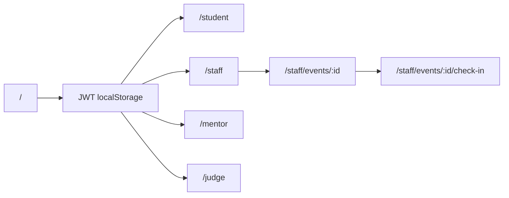
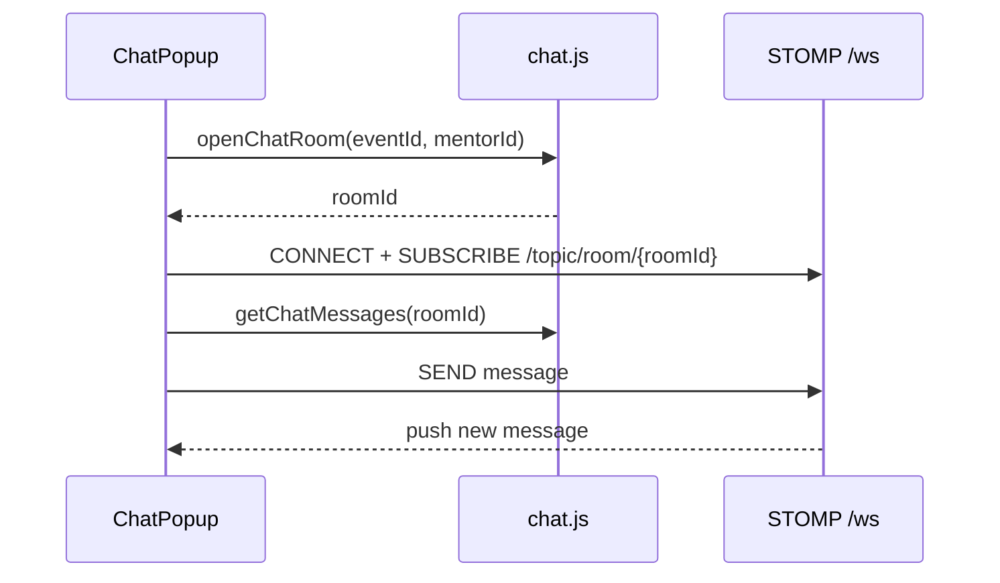

# Kiến trúc Frontend — SEAL Hackathon

Tài liệu mô tả **cấu trúc kỹ thuật** của React app (`frontend/`): routing, auth, API layer, shared UI, chat realtime.

**Cập nhật:** 2026-06-12  
**Đối chiếu BE:** `docs/EVENT_LOGIC.md`

---

## 1. Tech stack

| Thành phần | Công nghệ |
|------------|-----------|
| Framework | React 18 + Vite 5 |
| Routing | `react-router-dom` v6 |
| HTTP | `fetch` qua wrapper `apiFetch` |
| Realtime chat | STOMP + SockJS (`@stomp/stompjs`, `sockjs-client`) |
| State global | React Context (`AuthContext`, `ToastContext`) |
| Deploy | Vercel (`vercel.json`) |

Không dùng Redux/Zustand — state chủ yếu **local `useState`** trong từng page.

---

## 2. Cấu trúc thư mục

```
frontend/
├── src/
│   ├── main.jsx              # Entry: BrowserRouter + App
│   ├── App.jsx               # Route tree + lazy load dashboards
│   ├── api/                  # HTTP clients (1 file ≈ 1 domain BE)
│   ├── components/
│   │   ├── common/           # Modal, FormField, Pagination, Avatar…
│   │   ├── layout/           # TopBar, DashboardLayout, HomeNavbar
│   │   ├── dashboard/        # TabNav, ModuleContainer, DashboardHeader
│   │   ├── chat/             # ChatPopup, TeamChatPanel
│   │   └── expert/           # ExpertGroupColleaguesBoard
│   ├── context/              # AuthContext, ToastContext
│   ├── guards/               # RequireAuth, RequireRole
│   ├── hooks/                # useChatStomp, useRecaptcha
│   ├── pages/
│   │   ├── HomePage.jsx      # Landing (public)
│   │   └── dashboards/       # Student, Staff, Mentor, Judge, Event detail
│   ├── styles/global.css
│   └── utils/                # jwt, errors, roleLabels, recaptcha
├── vite.config.js            # Proxy /api, /ws → localhost:8080
├── .env.example
└── docs/                     # Tài liệu FE (file này + FE_DASHBOARDS.md)
```

---

## 3. Routing & lazy load

Định nghĩa tại `App.jsx`:

| Path | Guard | Component |
|------|-------|-----------|
| `/` | — | `HomePage` |
| `/student` | `RequireRole role="Student"` | `StudentDashboard` |
| `/staff` | `RequireRole role="Staff"` | `StaffLayout` (multi-tab) |
| `/staff/events/:eventId` | Staff | `EventDetailsPage` |
| `/staff/events/:eventId/check-in` | Staff | `StaffCheckInPage` |
| `/mentor` | `RequireRole role="Mentor"` | `MentorDashboard` |
| `/judge` | `RequireRole role="Judge"` | `JudgeDashboard` |
| `/profile` | `RequireAuth` | `StaffProfilePage` |
| `*` | — | redirect `/` |

Dashboard được **lazy import** (`React.lazy` + `Suspense`) để giảm bundle initial.



---

## 4. Auth & phân quyền

### 4.1 Lưu trữ session

`AuthContext` persist vào `localStorage`:

| Key | Nội dung |
|-----|----------|
| `hh_token` | JWT Bearer |
| `hh_email` | Email user |
| `hh_role` | Role BE (`COORDINATOR`, `STUDENT_FPT`, …) |
| `hh_full_name` | Họ tên |
| `hh_avatar_url` | URL avatar |

Login flow (`auth.js` → `client.parseLoginResponse`):

1. `POST /api/auth/login` (kèm reCAPTCHA)
2. Parse JSON `{ token, avatarUrl }` hoặc legacy plain text
3. Đọc `role` từ **JWT claim** (`utils/jwt.js`)
4. `saveAuth({ token, role, avatarUrl })`

Register / reset password dùng **OTP 2 bước** — cần `credentials: 'include'` để giữ `JSESSIONID` giữa bước gửi OTP và xác nhận.

### 4.2 Role alias (route guard)

`RequireRole` map alias UI → role BE:

| Alias route | Role BE được phép |
|-------------|-------------------|
| `Staff` | `COORDINATOR` |
| `Student` | `STUDENT_FPT`, `STUDENT_EXTERNAL` |
| `Mentor` | `EXPERT_INTERNAL`, `EXPERT_EXTERNAL` |
| `Judge` | `EXPERT_INTERNAL`, `EXPERT_EXTERNAL` |

**Lưu ý:** Mentor và Judge **cùng role DB** (`EXPERT_*`). Phân biệt bằng **phân công** (`mentor_assignments` / `judge_assignments`), không phải role JWT. FE cho phép expert vào cả `/mentor` và `/judge` (link chuyển khu trong dashboard).

### 4.3 Redirect sau login

`AuthContext.ROLE_PATHS`:

| Role | Dashboard mặc định |
|------|-------------------|
| `COORDINATOR` | `/staff` |
| `STUDENT_*` | `/student` |
| `EXPERT_*` | `/mentor` |

---

## 5. API layer

### 5.1 `api/client.js`

- `API_BASE` = `VITE_API_BASE` (prod) hoặc `''` (dev → Vite proxy)
- `apiFetch(path, { method, body, auth })` — gắn `Authorization: Bearer <token>`
- `apiUpload(path, formData)` — multipart (avatar)
- `resolveAssetUrl(path)` — prefix URL tương đối từ BE

Lỗi mạng throw `Error('NETWORK')`. Lỗi HTTP throw message body text.

### 5.2 Module API theo domain

| File | Backend prefix | Mục đích |
|------|----------------|----------|
| `auth.js` | `/api/auth/*` | Login, register OTP, reset password, profile |
| `team.js` | `/api/team/*` | Team, join event, registrations, mentors |
| `event.js` | `/api/staff/events` | List/detail event (staff) |
| `eventService.js` | `/api/staff/events/*` | CRUD rounds, groups, teams, awards |
| `staff.js` | `/api/staff/*` | Accounts, status, registration approve |
| `staffAssignment.js` | `/api/staff/assign/*` | Gán mentor/judge |
| `mentor.js` | `/api/mentor/*` | Mentor dashboard data |
| `checkIn.js` | `/api/staff/check-in/*` | Check-in event |
| `criteriaApi.js` | `/api/staff/criteria` | Tiêu chí chấm |
| `university.js` | `/api/universities` | Trường ĐH (public/staff) |
| `staffUniversity.js` | `/api/staff/universities` | CRUD trường (staff) |
| `chat.js` | `/api/chat/*` | Phòng chat, messages |
| `normalizers.js` | — | Map snake_case ↔ camelCase, normalize UUID |

**Pattern chung:** mỗi hàm export gọi `apiFetch` → `JSON.parse` → map qua normalizer → throw message tiếng Việt nếu fail.

### 5.3 Dev proxy

`vite.config.js`:

```
/api  → http://localhost:8080
/ws   → http://localhost:8080 (WebSocket)
```

Prod: set `VITE_API_BASE=https://your-backend` (không slash cuối).

---

## 6. Layout & UI shell

### 6.1 `DashboardLayout`

Shell dùng chung mọi dashboard:

```
TopBar → TabNav (optional) → ModuleContainer → DashboardHeader + content → SiteFooter
```

- Tab multi-page (Staff): state trong URL `?tab=<key>` (`useSearchParams`)
- Single-page (Student, Mentor): truyền `children` trực tiếp

Props quan trọng:

| Prop | Ý nghĩa |
|------|---------|
| `roleLabel` | Nhãn hiển thị trên TopBar |
| `showStudentFields` / `showStaffFields` | Menu account dropdown |
| `tabs` | `[{ key, label, content }]` |

### 6.2 Component dùng lại nhiều

| Component | Vai trò |
|-----------|---------|
| `FormField`, `FormMessage`, `LoadingButton` | Form pattern |
| `Modal`, `ConfirmModal` | Dialog xác nhận |
| `Pagination` | Phân trang client-side (PAGE_SIZE thường = 5) |
| `LoadingState` | Skeleton / spinner |
| `AccordionCard` | Staff events list |
| `PendingTeamsBadge` | Badge đội chờ duyệt |
| `ComingSoonCards` | Placeholder (Judge dashboard) |
| `Avatar`, `AccountDropdown` | Profile header |

### 6.3 Toast & lỗi

- `ToastContext.showToast(message, type)` — `success` | `error`
- `utils/errors.localizeError(raw)` — map message BE → tiếng Việt thân thiện

---

## 7. Chat realtime

Luồng (`ChatPopup.jsx` + `useChatStomp.js`):



- Student mở chat từ mentor card (sau khi registration `APPROVED`)
- Mentor mở chat từ dashboard (team list)
- JWT dùng làm STOMP auth header

---

## 8. reCAPTCHA

- `hooks/useRecaptcha.js` + `RecaptchaWidget.jsx`
- Bắt buộc trên login / register (theo BE)
- Site key từ `VITE_RECAPTCHA_SITE_KEY` hoặc `.env.properties`

---

## 9. Quy ước code FE

| Quy ước | Chi tiết |
|---------|----------|
| Pagination | Client-side slice array, không server paging |
| Date hiển thị | `toLocaleString('vi-VN')` |
| Status pill | Class CSS `status-active`, `status-pending`, … |
| Event ID | Luôn qua `normalizeEventId()` trước khi gọi API |
| Confirm destructive | `ConfirmModal` trước DELETE |
| Refresh sau mutation | Callback `onSuccess` / tăng `refreshKey` |

---

## 10. Gap / chưa có trên FE

| Hạng mục | Ghi chú |
|----------|---------|
| `GET /api/events` public | Landing chưa gọi — HomePage static |
| `PUT /api/team/submit-project` | Chưa có UI nộp bài |
| `PUT /api/team/leave-event` | Chưa có |
| Judge scoring UI | `JudgeDashboard` = ComingSoon |
| Mentor view submission | Chưa có link xem bài nộp |
| Staff filter emails | Chưa có (BE task) |
| Announcements tab | File/page còn trong repo; BE đã gỡ endpoint (cần sync FE) |

Chi tiết luồng từng dashboard → xem **`FE_DASHBOARDS.md`**.

---

## 11. File tham chiếu nhanh

| Mục | File |
|-----|------|
| Routes | `src/App.jsx` |
| Auth | `src/context/AuthContext.jsx`, `src/api/auth.js` |
| HTTP client | `src/api/client.js` |
| Guards | `src/guards/RequireRole.jsx` |
| Layout | `src/components/layout/DashboardLayout.jsx` |
| Env / proxy | `vite.config.js`, `.env.example` |
